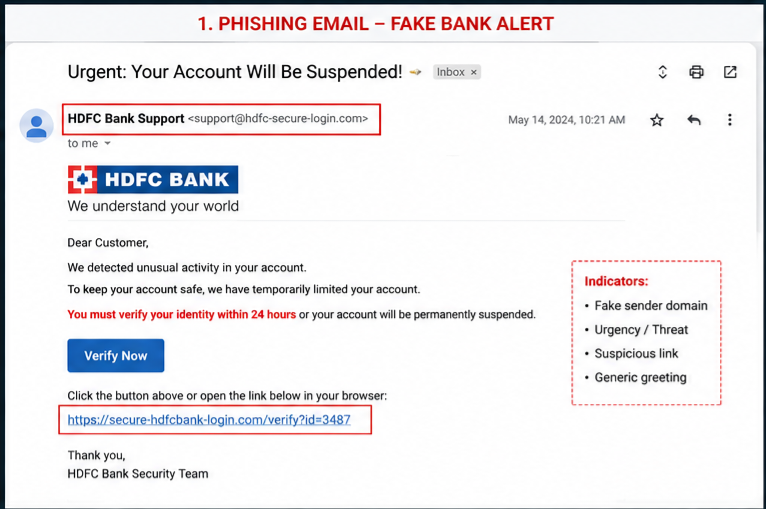
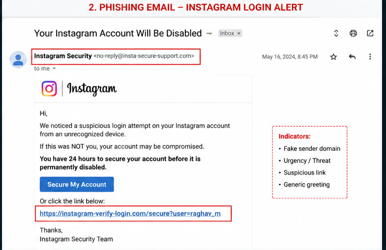
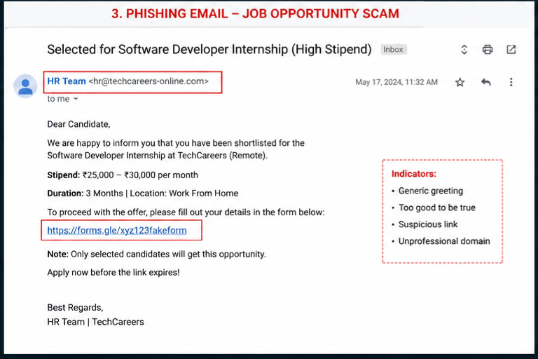
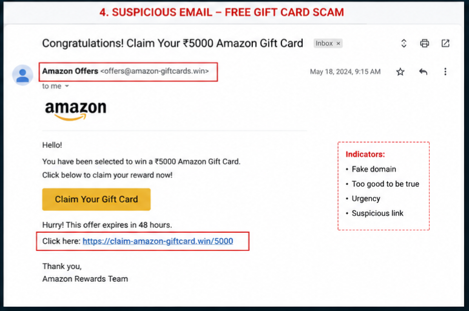
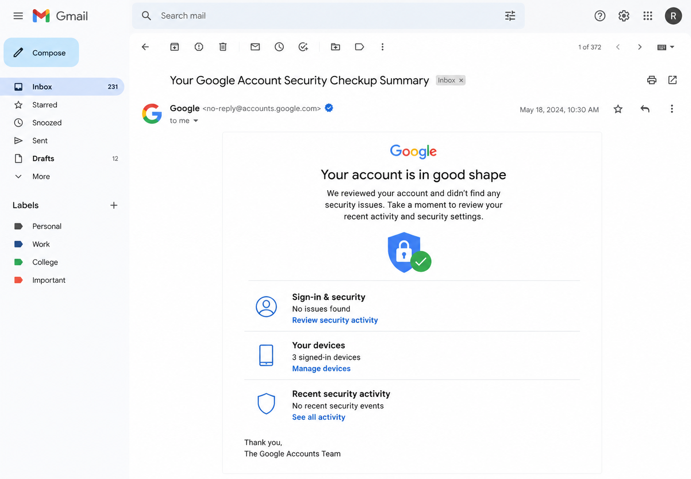

````md
# 🎣 Phishing Email Detection & Awareness

<div align="center">


</div>

---

# 📌 Project Overview

This repository contains the submission for **Task 02** of the **Future Interns Cyber Security Internship**.

The objective of this task was to analyze phishing email samples and identify common cyber fraud techniques used in phishing attacks and social engineering scams.

This project demonstrates:
- Phishing email analysis
- Identification of suspicious sender domains
- Detection of malicious links
- Comparison between phishing and legitimate emails
- Cybersecurity awareness practices

---

# 🎯 Objectives

- Understand how phishing attacks work
- Analyze suspicious email structures
- Detect fake domains and malicious URLs
- Differentiate between phishing and legitimate emails
- Spread cybersecurity awareness regarding email scams

---

# 🛠 Tools & Technologies Used

| Tool | Purpose |
|------|----------|
| GitHub | Project Documentation |
| Email Analysis Techniques | Phishing Detection |
| Screenshot Documentation | Evidence Collection |
| Cybersecurity Awareness Concepts | Threat Analysis |

---

# 📂 Repository Structure

```bash
FUTURE_CS_02/
│
├── report/
│   └── Phishing_Email_Awareness_Report.pdf
│
├── screenshots/
│   ├── 1-bank-phishing.png
│   ├── 2-instagram-phishing.png
│   ├── 3-job-scam.png
│   ├── 4-giftcard-scam.png
│   └── 5-safe-google-email.png
│
└── README.md
````

---

# 📧 Email Samples Analysis

---

# 1️⃣ Fake Bank Alert Email

## 🔍 Indicators Identified

* Fake sender domain
* Urgency and fear tactics
* Suspicious verification link
* Generic greeting

## 📸 Screenshot



---

# 2️⃣ Instagram Login Alert Scam

## 🔍 Indicators Identified

* Fake Instagram security domain
* Suspicious login verification link
* Fear-based language
* Urgent action request

## 📸 Screenshot



---

# 3️⃣ Fake Internship / Job Scam

## 🔍 Indicators Identified

* Unrealistic salary offer
* Generic hiring email
* Suspicious Google Form link
* Unprofessional sender domain

## 📸 Screenshot



---

# 4️⃣ Amazon Gift Card Scam

## 🔍 Indicators Identified

* Fake rewards domain
* “Too good to be true” offer
* Urgency tactics
* Suspicious claim link

## 📸 Screenshot



---

# 5️⃣ Legitimate Safe Email

## ✅ Safe Characteristics

* Trusted sender domain
* Professional formatting
* No urgency or threats
* Secure and valid links

## 📸 Screenshot



---

# 🚨 Common Phishing Indicators Observed

| Indicator          | Description                               |
| ------------------ | ----------------------------------------- |
| Fake Domains       | Sender email mimics trusted organizations |
| Suspicious Links   | Redirect users to malicious websites      |
| Urgency Tactics    | Creates panic to force quick action       |
| Generic Greetings  | Uses “Dear User” instead of real names    |
| Unrealistic Offers | Fake rewards, prizes, or salaries         |
| Social Engineering | Manipulates users emotionally             |

---

# 🛡 Cybersecurity Awareness Tips

✅ Verify sender email addresses carefully
✅ Avoid clicking suspicious links
✅ Never share OTPs or passwords
✅ Use Multi-Factor Authentication (MFA)
✅ Check domains before logging in
✅ Avoid downloading unknown attachments
✅ Report phishing emails immediately

---

# 📚 Key Learnings

Through this project, I learned:

* How phishing attacks are structured
* Real-world social engineering techniques
* Identification of malicious domains and URLs
* Importance of cybersecurity awareness
* Practical analysis of suspicious emails

---

# ✅ Conclusion

Phishing attacks are one of the most common cybersecurity threats used to steal sensitive information from users.

This task helped in understanding how attackers manipulate users using fake emails, urgency tactics, and malicious links.

Awareness, careful verification, and cybersecurity best practices can significantly reduce the risk of phishing attacks.

---

# 👨‍💻 Author

## Raghav Marda

Cyber Security Intern — Future Interns

---

```
```
